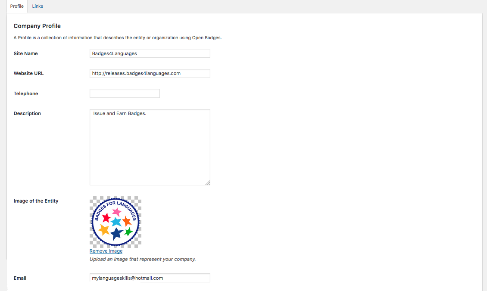
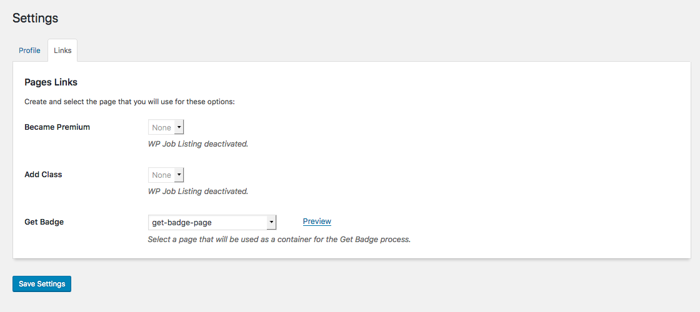
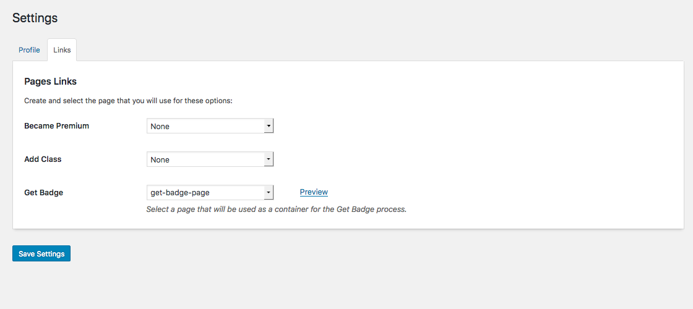
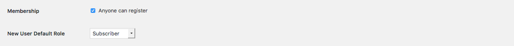
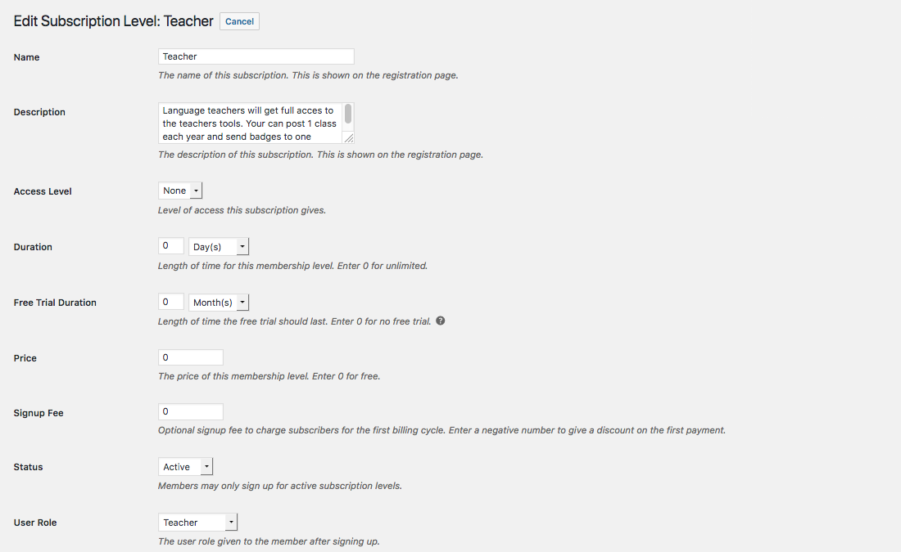

# OpenBadgesFramework Technical Documentation

## Installation and Upgrades
1. Clone (or copy) this [repository](https://github.com/Badges4Languages/OpenBadgesFramework/releases) to the /wp-content/plugins/ directory
1. Activate the Plugin through the 'Plugins' screen in WordPress

For upgrades, download the last stable version from Github, delete from FTP the old Plugin and install the new one.

Remember, permalink in Post name option activated is necesary.

## Setup the Plugin

### Plugin settings

#### Profile Tab
OpenBadges need some key information for the delivery of the Badge. Without that information, the Plugin will not work:
* Site Name (by default, take the site name from ```get_bloginfo ('name')```)
* WebSite URL (by default, take the url from ```get_bloginfo ('url')```)
* Image URL
* Backpack account (by default, take the mail administrator from ) ```get_bloginfo ('admin_email')```)



#### Links Tab
The users have some shortcuts to make easier the process. Here is the place where the links to those shortcuts are created:
* Change the role. Teachers can change the role from Send Badge page.
* Add class. Shortcut to create a new Class from Send Badge page.
* Get Badge. Redirection page for users after opening the email (by default, OBF will create a page /get-badge-page/ after the first activation).





#### Email Settings
In this section the user can fill the information that will be displayed to the email which a badge receiver will receive when he is sent a badge
* Site Name
* Website URL
* Email Contact
* Image of the entity
* Header
* Message

#### About us

General information for the administrators of the site

### Manage Roles and Capabilities
--- https://es.wordpress.org/plugins/wp-user-groups/ ----

OpenBadgesFramework offer 3 types of roles with different capabilities:
(Out of the box, the OBF roles is Subscriber as just the when the Wordpress **Read** capability is activated)
* **Student**
  * read (a WP capability)
  * obf_send_self (allow to self send Badges)
* **Teacher**
  * read (a WP capability)
  * obf_send_self (allow to self send Badges)
  * obf_send_single (allow to send a Badge to one Student at a time)
* **Academy**
  * read (a WP capability)
  * obf_send_self (allow to self send Badges)
  * obf_send_single (allow to send a Badge to one Student at a time)
  * obf_send_multiple (allow to send a Badge to multiple Students at once)
  * obf_send_certificate (allow to send certified Badges)
  * obf_send_teacher (allow to send Teacher Badges)
  * obf_job_listing_integration (allow to save Badges in Classes where a Class is a post of WP Job Manager)
  * obf_user (allow to see in the Back-end the user information)

  Also it use the default WP Administrator Role for the settings of the Plugin.

Out of the box, a new user can have (after the login) one of those roles (upon the configuration of the site) and later the administrator can change the role to a more related one.



If an automatization of the distribution of the roles is needed , RCP (or an alternative) must be activated and setup.



Remember to assign a match to each [subscription level](http://docs.restrictcontentpro.com/article/1558-creating-subscription-levels) with the user role.


A 'Select the Role' page is needed (can be free or paid upon the configuration).

The OpenBadgesFramework Settings page allow in **Links** tab to select the page where the [Register Form](http://docs.restrictcontentpro.com/article/1597-registerform) is created.

With a Plugin of roles and capabilities (like [Members](https://es.wordpress.org/plugins/members/ "Members plugin website")), the capabilities can be assigned to another role and use the functionalities.


#### Student role
* Can receive Badges and keep the profile information.
* Can self issue a non certified badge.
* Can comment the class after receiving the Badge.

#### Teacher role
The same as Student role plus:
* Can self issue a teacher Badge.
* Can send a non certified Badge to one Student at a time.
* Save all the Students information in one single class.
* Can answer the class Studens' comments.
* The profile can be deleted but the Classes information cannot ever be deleted.

#### Academy Teacher role
The same as Teacher role plus:
* Can send a non certified Badge to multiple Students at a time.
* Can send a certified Badge to one Student/multiple Students at a time.
* Can create multiple Classes.

#### Administrator role
The same as Academy role plus:
* Can send certified Teachers Badges

## Creation of the Badges
OpenBadgesFramework allow the creation of two types of Badges for the **Administrators** of the site. Normal Badges and Certified Badges.
* Normal Badges can be delivered by any user of the site with Teacher Role.
* Certified Badges are allowed just for Teachers with the Academy Role.

For the creation of a Badge is necessary:
* Name: The name of the Badge.
* Description: A description for the Badge.
* Badge Criteria: The Criteria for different languages (just the first one is used).
* Image: The feature image.

Other information is necessary for the correct integration with the site:
* Content: information about the badge.
* The Certification Type: Not certified/Certified.
* The Target type: Student/Teacher.
* Field of education: the subject of the Class (The second language). Not used.
* Levels: the level of the Class (Students: A1-A2-B1-B2-C1-C2; Teachers: T1-T2-T3-T4-T5-T6).

Optional:
* Description translations (WP Comments): A translation of the description.

## Sending of Badges (Issuer page)
OpenBadgesFramework allow to issue badges in 3 ways:

Administrators have the same functionalities as the Academy Teacher role plus the issue of certified Teacher Badges.

Those are the options before sending a Badge:
* **Field of education**: the student's learning subject.
* **Level**: the level of the Class.
* **Badge**: the Badge name.
* **Description**: the Reference Level Descriptors of the Badge. By default Badges are in English, but translations are available.
* **Class**: the Student Class name with information like starting date and place (Just Academy teachers role). It requires [Job Manager](https://wpjobmanager.com/ "WP Job Manager plugin") Plugin activation.
* **Mail**: the Student's email.
* Information:
  * **Addition information**: Some information that will be showed in the description of Badge.
  * **Criteria**: Url of the work or of the document that the recipient did to earn the Badge.

If the Student has a Badge and a Teacher send the same Badge again, no updates are done in the database.

### Send Badges pages

#### Issuer page Self mode
A Student/Teacher/Academy teacher role can receive a Badge as Student or Teacher (Non certified).

* Field of education
* Level
* Badge
* Description
* Information:
  * Addition information
  * Criteria

#### Issuer page Issue mode
A Teacher/Academy Teacher role can send a Student Badge (Non-Certified).

An Academy teacher role can send a Student Badge (Certified)

* Field of education
* Level
* Badge
* Description
* Class (Just available if activate)
* Mail
* Information:
  * Addition information
  * Criteria

#### Issuer page Multiple issue mode
An Academy Teacher role can send Multiple Badges to Multiple Students (Certified and Non-Certified).

* Field of education
* Level
* Badge
* Description
* Class (Just available if activate)
* Mail (Multiple)
* Information:
  * Addition information
  * Criteria
  
#### Send Badges Notice
The plugin is developed in that way that doesnt allow a Teacher/Academy Teacher to send a badge to himself in the Single or Multiple way,
but only by the Self way.
Also in the Multiple way,we have set a limitation that a Teacher?Academy teacher can send a badge to maximum 5 people,
this can be changed by the send-badge.js file in the check_mails() method.


### Database

Open Badges Framework save all the badges information related to Teachers and Students with 2 [custom Database Tables](https://codex.wordpress.org/Creating_Tables_with_Plugins)

#### Users Database
```
id  userEmail            idWP
1   student@student.com  1
```

#### Users Database columns
* **id**: The id of the row.
* **userEmail**: The Earn user email.
* **idWP**: The Wordpress Earn uses id.

#### Badges Database

```
id            badgeId   fieldId   levelId   classId   teacherId    roleSlug         dateCreation          getDate               getMobDate    json                                                                 info                                  evidence
1  			  140       1712      7                   1            administrator    2018-01-01 08:00:00   2017-12-18 09:00:00                 161499a421c21ea585cc025d04f0e3d439d6220451b22c820c62d4478fc6aaf0 	That is an example of information.    https://www.example.edu/student-list.php
```
##### Badges Database columns
* **id**: The id of the row.
* **userEmail**: The Earn user email.
* **badgeId**: The ID of the Badge the Student receive.
* **fieldId**: The ID of the Field of education of the Badge.
* **levelId**: The ID of the Level of the Badge.
* **classId**: If the Badge is inside of a Class, the Class id.
* **teacherId**: The issuer user ID.
* **roleSlug**: The role of the issuer.
* **dateCreation**: The date of the issue of the Badge.
* **getDate**: The date of the earn of the Badge.
* **getMobDate**: If the Badge is transfer to Mozilla Backpack.
* **json**: The Json file name.
* **info**: The information the Teacher write about the Students.
* **evidence**: Is the link to an external url where the Teacher can show an evidence of the Badge (pdf with a list of notes, a site with students names...).
* **Json file**: By sending a Badge, 3 Json file are created inside of the folder open-badges-framework > Json. The Json files remain forever (For now).

#### Database Notice
The plugin is developed in that way so when a user account is deleted from the Wordpress DB,
this user is also deleted from the custom Users Database table.

Also when a user changes his email through  Update Profile,the plugin tracks this change and also
updates the email of this user to the custom Users Database table.


### Json files

[openbadges-specifcation/Assertion](https://github.com/mozilla/openbadges-specification/blob/master/Assertion/latest.md)

Open Badges contain detailed metadata about achievements. Who earned a Badge, who issued it, and what does it mean? The data is all inside.

Information is divided between Badge objects that describe an individual earner’s accomplishment (Assertion), the general features of the achievement (BadgeClass), and the entity or organization issuing the Badge (Issuer)

#### Issuer Organization file
A file with the issuer organization info (just one file each installation):
issuer-info.json
```
{
  "name": "Site Name",
  "url": "http://site-name.com.com",
  "description": "Issue and Earn Badges.",
  "image": "http://site-name.com/wp-content/uploads/2017/05/badge-image.png",
  "email": "webmaster@site-name.com.com"
}
```
####Badge Class

One Json file is the badge details

Example fo file name: badge-cc8197a1a66bd28d240934e16a895183f7a59e2285eb5e8b408ebba515ff
```
{
  "name": "Badge Name",
  "description": "FIELD: Field of education Name  \u2013  LEVEL: Level Name  \u2013  DESCRIPTION: Can understand and use familiar everyday expressions and very basic phrases aimed at the satisfaction of needs of a concrete type.\r\nCan introduce themselves and others and can ask and answer questions about personal details such as where he/she lives, people they know and things they have.\r\nCan interact in a simple way provided the other person talks slowly and clearly and is prepared to help.  \u2013  Additional information: That is an example of information.",
  "image": "http://site-name.com/wp-content/uploads/2018/01/badge.png",
  "criteria": "http://site-name.com/open-badge/badge-name/",
  "tags": ["Field Of Education Name", "Level Name"],
  "issuer": "http://site-name.com/wp-content/uploads/open-badges-framework/json/issuer-info.json"
}

```
####Badge Assertion
One Json file is the earner details 

Example of the file name: cc8197a1a66bd28d240934e16a895183f7a59e2285eb5e8b408ebba515ffa5dd.json
```
{
  "uid": "5a3272e5b6ffb",
  "recipient": {
    "type": "email",
    "identity": "student@student.com",
    "hashed": false
  },
  "badge": "http://badges4languages.com/wp-content/uploads/open-badges-framework/json/badge-cc8197a1a66bd28d240934e16a895183f7a59e2285eb5e8b408ebba515ffa5dd.json",
  "verify": {
    "url": "http://badges4languages.com/wp-content/uploads/open-badges-framework/json/cc8197a1a66bd28d240934e16a895183f7a59e2285eb5e8b408ebba515ffa5dd.json",
    "type": "hosted"
  },
  "issuedOn": "2018-01-01",
  "evidence": "https://www.center-name.edu/student-list.php"
}

```
## Getting Badges
The user must login and register to the site using the email account from which he retrieved the link for the 'Get Badge' page 


## User profile
All the roles have a profile for tracking the information of the received Badges.

The saved information in the profile is:
* Badge name
* Badge language
* Sender
* Comment

## Shortcodes
The frond-end fuctionality can be use in any page with the shortcode ```[send_badge]```.

If we need to show just one of the 3 types of the Send Badges subpages, we can use the following shortcodes:

 * [send-badge form="a"] -> self
 * [send-badge form="b"] -> issue
 * [send-badge form="c"] -> multiple
 * [send-badge form="all"] -> all together
 *
 * [send-badge ... sec-form="..."] -> add a second form (a/b/c) that will be show with the first

## Customization
Appearance

Modify Colors and More

Booking Service Integration

Book Tables, Services, and More

Customization Code Snippets

Collection of Code

Child Themes

Advanced Customization Techniques

Translations

Change Text and Words

#### Teachers Stats

In this page it is being shown the information about how many badges a Teacher or Academy Teacher has sent.
it is planed for the future to create a column about 'Ratio' instead of 'Nothing' for analyzing the data.

#### Translation of the Description of the Badges

Theis feature is being done by adding a new field(a dropdown list that contains the languages) at the default WP comment form.
The user picks a language from the list and then writes a comment(translation).
Only administrators and academy teachers can create translations for the description of the Badge.
For each language only one translation of the decription should exist.

When a Teacher/Academy Teacher/Administrator sends a Single badge or a Multiple badge,at the Description tab he can pick one translation
from the dropdown list with available translations for this specific desccription of the badge that he wants to send or he can just send the 
badge with the default description.

The file that this feature is developed is ExtendComment.php


---
Back to [Readme](../README.md).
