# Table of Contents
  * [Dashboard section](#Dashboard section)
  * [Badges](#Badges)
  * [Fiels of education](#Fiels of education)
  * [Levels](#Levels)
  * [Send Badges](#Send Badges)
  * [Settings](#Settings)

#Dashboard section

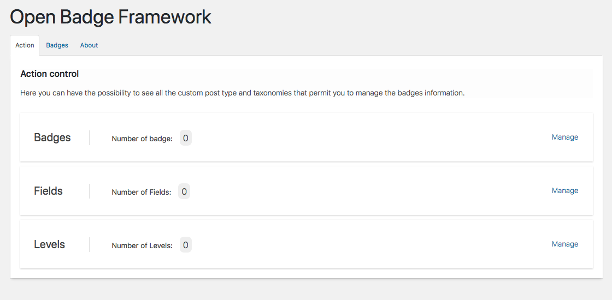

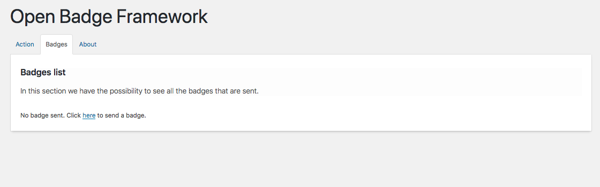

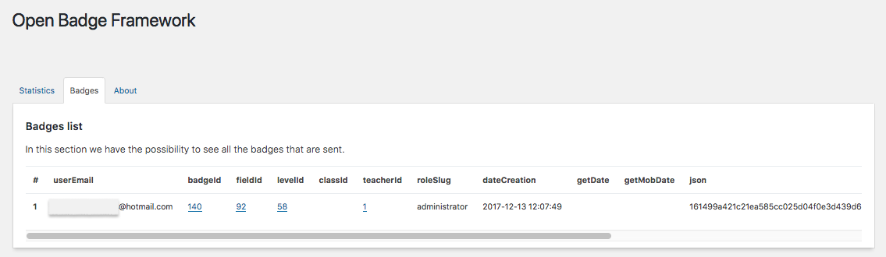

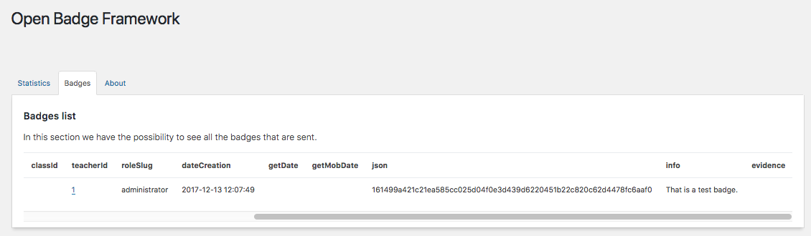

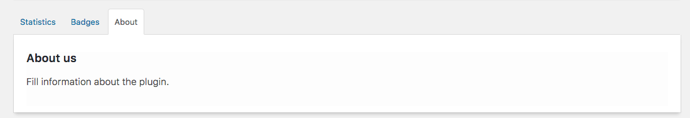

#Badges

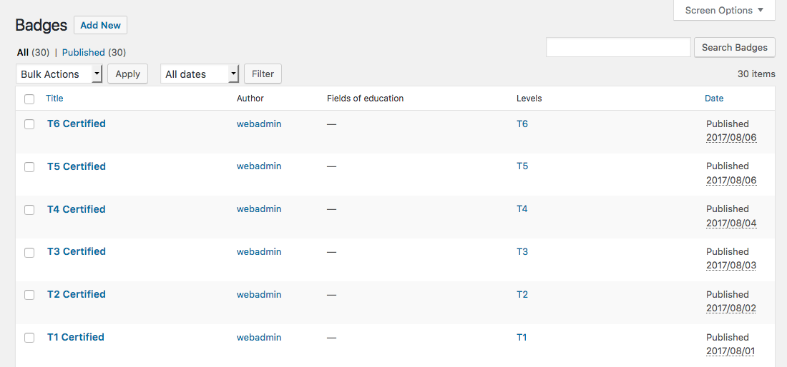

#Fiels of education

#Levels

#Send Badges

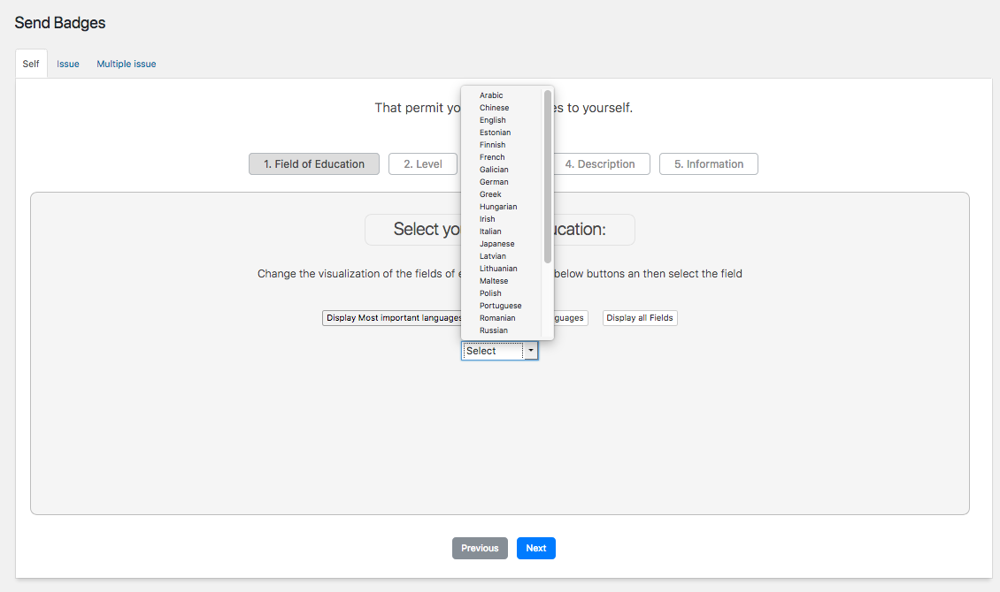

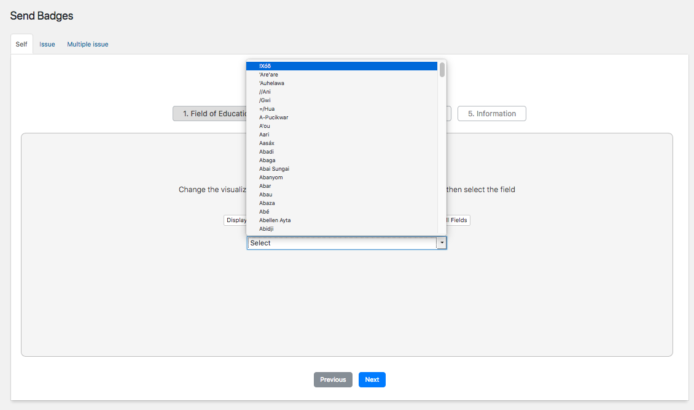

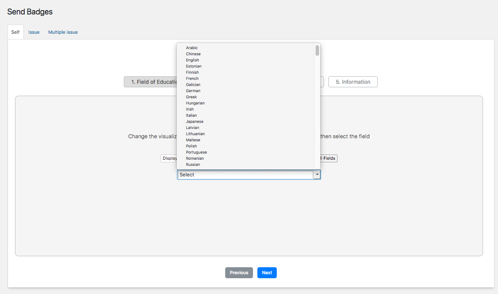

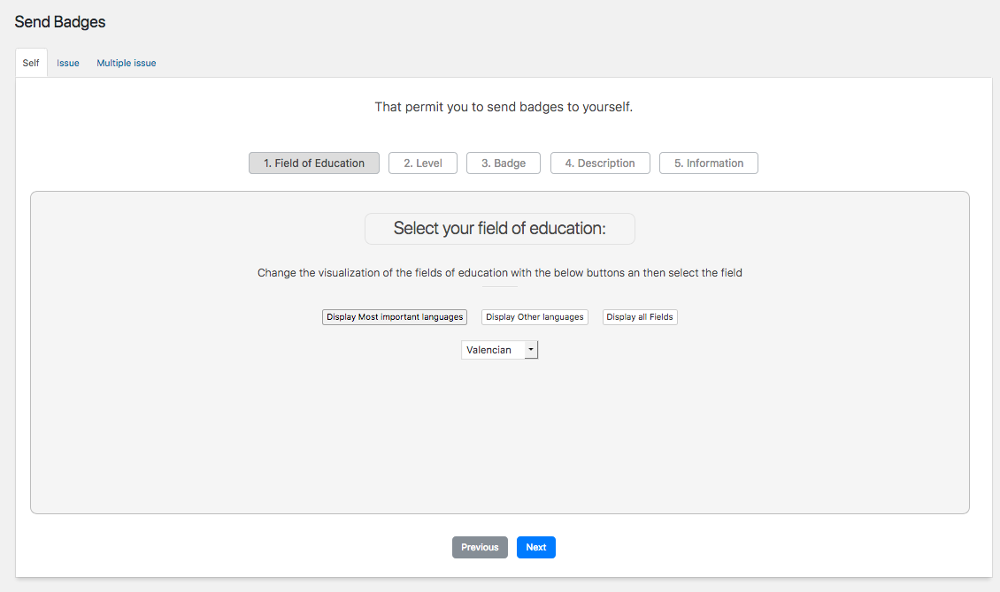

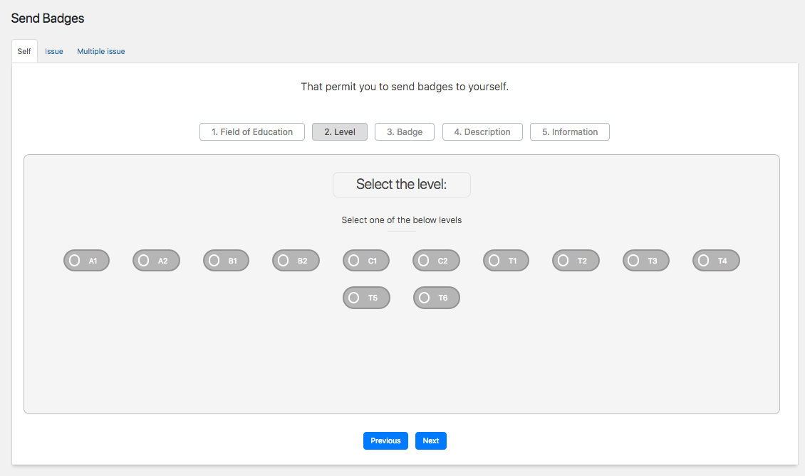

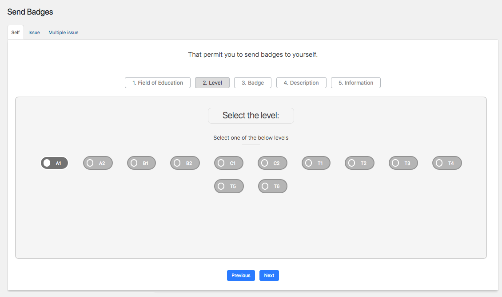

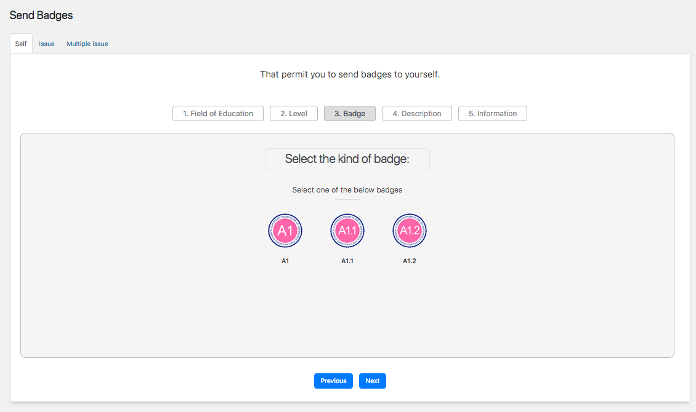

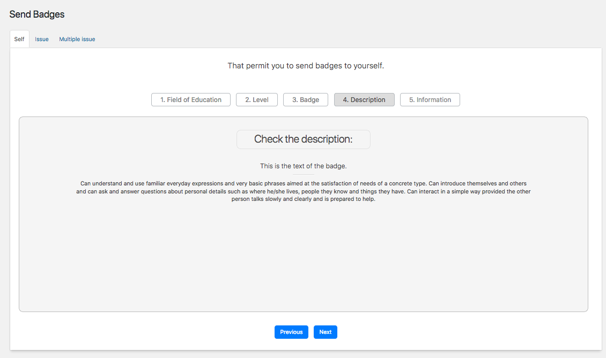

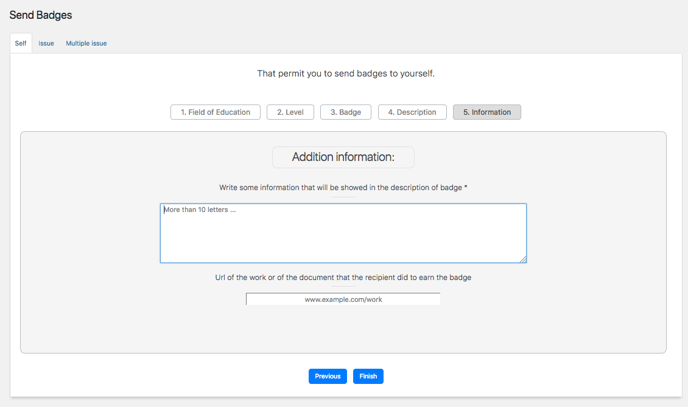

#Settings

