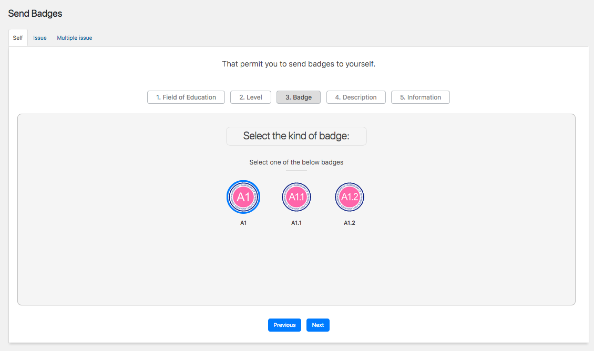

# Table of Contents
  * [Dashboard section](#Dashboard section)
  * [Badges](#Badges)
  * [Fiels of education](#Fiels of education)
  * [Levels](#Levels)
  * [Send Badges](#Send Badges)
  * [Settings](#Settings)

#Dashboard section

<<<<<<< HEAD

=======

>>>>>>> 27823bafb4414169c0ebd560302c4a9e9cbcb76b

#Badges

#Fiels of education

#Levels

#Send Badges

#Settings

